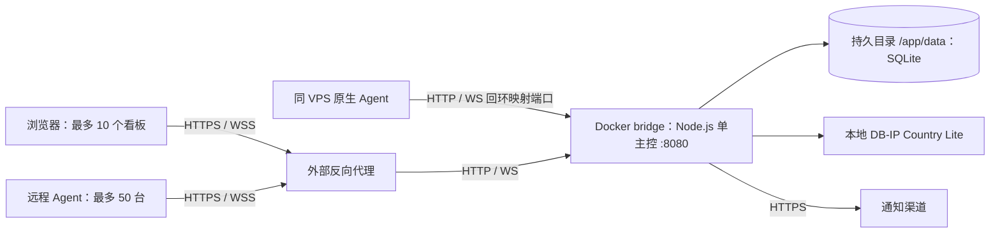

# 项目架构

版本：3.0.0；更新时间：2026-09-17。全新安装、独立二开，不迁移 Workers/D1 数据。

## 部署结构

同一进程同时提供前端、REST、Agent WS 和看板 WS。不存在 Workers、D1、Durable Objects、Turnstile 或外部数据库依赖。Compose 默认将容器 8080 映射到宿主机 127.0.0.1:8080；后台可生成公网域名安装命令。同机 Agent 可通过宿主机映射端口访问主控，采集宿主机指标，无需加入容器网络。

## 同仓库原生 Agent 与分发

`agent/` 纳入 cfsm-agent v1.0.16 源码和 MIT 许可，独立 Agent 版本 v1.1.1；具体来源由
`agent/UPSTREAM.md` 固定。保持原采集、探测、流量、HTTP/WS、配置协议和平台服务逻辑。
`CONTROLLER_URL` 兼容 `WORKER_URL`，不要求 Workers 运行时。

构建阶段由 Go 编译 Linux、FreeBSD 各 amd64/arm64，共 4 种程序，生成 SHA-256 manifest。
Docker 最终镜像携带 `agent-dist/`，不携带 Go 编译器。`AgentDistribution` 提供只读 `/agent` 下载、
版本目录和安装脚本；后台版本提示及 Agent 自更新均访问该目录，不访问上游 GitHub。
下载流式传输，只接受已登记的版本和文件名，拒绝目录遍历和外部符号链接；安装及更新校验 SHA-256。

正式启动入口将内置版本校验后归档到持久卷 `data/agent-releases/`，同版本的不同产物拒绝覆盖。
自动更新仍默认关闭；启用时保留启动检查、6 小时周期和原平台替换/重启机制，支持显式下载镜像。
历史版本通过版本目录保留并支持手动指定安装；自动更新不降级。旧归档按完整 manifest 校验，磁盘文件不被自动删除；公开版本目录、manifest、校验清单和下载入口只暴露当前支持的 4 类目标。Windows 安装脚本不再打包或提供下载。SQLite 备份不包含这些可重建的二进制文件。

## 运行模块

| 模块 | 职责 |
| --- | --- |
| HTTP 运行时 | 请求体限额、可信反代地址、静态资源、健康检查、登录限流、WS Upgrade |
| 路由及处理器 | 权限检查、管理操作、看板、历史、主题和备份 |
| RealtimeHub | Agent 会话、前端订阅、指标聚合、配置推送、资源告警窗口 |
| SQLite 存储 | 同步事务、WAL、UUID 数据隔离、索引查询、在线一致性备份 |
| Scheduler | 每分钟检查离线、资源、流量、到期、WS 时段及历史保留，投递通知；GeoIP 启动检查并每 24 小时更新 |
| Vue 前端 | 管理、实时看板、详情图表、主题、下载备份 |

## 后台入口与双重验证

`.env` 的 `ADMIN_PATH` 是必填的 8–128 位随机路径段。根路径始终提供看板；后台页面、API 和备份分别位于 `/<ADMIN_PATH>`、`/<ADMIN_PATH>/api`、`/<ADMIN_PATH>/backup`，旧 `/admin` 返回 404。安全入口 meta 只注入该入口页面，公共配置只向已认证管理员返回路径；匿名内置看板不渲染后台链接。响应禁止缓存并使用 no-referrer。

TOTP 按 RFC 6238 使用 SHA-1、30 秒、六位数字，二维码由主控本地生成。独立 settings.admin_security 记录使用 API_SECRET 派生密钥加密的 TOTP 密钥、待确认绑定（10 分钟有效且绑定会话）、最近使用时间步、恢复码哈希和会话版本。绑定、关闭需重新验证当前密码，确认/关闭还需第二因素。同步 SQLite 事务保证验证码与恢复码不会并发重复使用。启用/关闭更换会话版本并撤销看板 WS，仅签发当前已验证会话；JWT 同时绑定安全路径摘要。

入口层对登录和 2FA 操作按来源 IP 与单管理员账户限流；涉及第二因素的尝试另有限额。备份包含加密 2FA 状态和已消费记录，恢复必须使用原 API_SECRET。

## 数据流与一致性

HTTP 上报验证 Secret、UUID、配置版本和样本后，在同一事务写历史及最新状态；成功后推送看板。Agent WS 保留原协议与配置协商：实时样本先聚合，按上报间隔写历史，只有实际写入成功才返回 `persisted:true`。为了兼容原 Agent，确认包继续使用 `nextD1WriteAfterMs` 字段名，底层已是 SQLite。

单连接消息串行处理，发送背压与消息大小有限制；连接心跳剔除失联会话。匿名订阅按服务器可见性过滤，修改可见性或站点权限后断开前端会话重新鉴权。管理员会话到期关闭 WS。

SQLite 使用 WAL、外键、FULL 同步及 5 秒 busy timeout。事务内禁止异步操作；服务器数量由数据库触发器限制为 50。历史与最新状态分开存储，删除服务器级联删除其数据，清理旧历史保留最新状态。

## 表结构

| 表 | 内容与约束 |
| --- | --- |
| servers | UUID 主键；展示、计费、采集、连接配置与通知状态；上限 50 |
| metrics_history | 独立整数主键；server_id 外键；(server_id,timestamp) 唯一索引；滚动保留 7 天 |
| server_latest | 每个 UUID 一行最近一次持久化的状态 |
| settings | 站点、外观、主题及 admin_security JSON；JWT 密钥、加密 2FA 与恢复码哈希持久化 |
| runtime_state | 资源告警窗口快照 |
| notification_outbox | 待发与已送达事件、重试次数、下次重试时间、失败原因 |

通知状态变化与事件入队在同一事务中，投递失败持续重试；已送达记录保留 7 天。采用至少一次投递：远端已接收而本地主控在落送达标记前崩溃时可能重复通知。

## 历史与地区

查询范围保持 10 分钟、30 分钟、1/6/12/24/48/96/168 小时；匿名用户最多 24 小时，管理员最多 7 天。短区间最多 160 点，长区间依后台配置为 60/120/180/240 点。看板延迟保留 2 小时、20 个桶，空缺不伪造为零。

看板实时样本通过现有回放管线更新对应延迟/丢包桶；20 桶固定到统一的 6 分钟边界，包含当前未结束桶，当前桶随上报更新，跨桶时向前滚动。`ts` 表示桶位置，`sample_ts` 保留实际样本时间，防止旧回放覆盖新值。历史成功落库立即使该服务器的窗口缓存失效，未改变的历史仍共享缓存；前端每分钟和 WS 重连后补取持久化历史，仅保留比最近持久化报告更新的本地样本。无样本显示灰色，超时与 0% 丢包分别处理；柱高随实际指标变化。

镜像构建下载 DB-IP Country Lite。运行时本地查询 IP，不向地区查询服务发送 Agent IP。地址依次使用真实公网来源、已认证 Agent 上报的公网 IP、主控公网 IP；同机私网/回环连接可用 `PUBLIC_IP`，为空时主控启动尝试发现自己的出口地址。后台手动地区优先。自动识别为国家/地区，不保证城市或机房位置准确。

主控从镜像内置库（可由 `GEOIP_PATH` 指定）与 `DATA_DIR/geoip/dbip-country-lite.mmdb` 中选择构建时间较新的有效库。调度器在启动后后台检查一次，之后每 24 小时按 UTC 当前月份下载；并发检查共用一个任务，失败也按每日周期重试。下载限时 120 秒，压缩体上限 16 MiB、解压上限 64 MiB，验证 MMDB 元数据及 IPv4/IPv6 国家查询后，先原子落盘再切换内存 Reader；相同内容不重复写盘，较旧版本拒绝安装。更新不阻塞监听端口，失败保留当前 Reader，关闭主控会取消下载再等待任务退出。持久库损坏可回退内置库，两者均不可用时拒绝启动。下载库随数据目录保留，不纳入 SQLite 备份。

## 备份、生命周期与边界

后台管理员下载 SQLite Backup API 创建的完整快照，包括历史、配置和通知队列。恢复时停止容器、替换数据库，保留对应 `.env`。不提供自动备份或在线恢复；恢复时可能重发快照中尚未确认的通知。

容器停止时停止调度、关闭连接、等待处理中任务、落库待写聚合与告警快照。断电或 SIGKILL 可能丢失尚未达到写入间隔的 WS 内存样本，已提交事务受 SQLite 保护。

仅支持单主控进程、本地文件系统持久卷。没有主控复制、共享网络数据库或跨实例缓存一致性。性能结果见 TEST_REPORT.md，不将短时负载测试等同于长期生产容量保证。

TOTP 协议参考：[RFC 6238](https://www.rfc-editor.org/rfc/rfc6238)；扫码 URI 参考：[Google Authenticator Key URI Format](https://github.com/google/google-authenticator/wiki/Key-Uri-Format)。
